<!--
  ╔══════════════════════════════════════════════════════════════════╗
  ║  Custom-built README. All animated SVGs are hand-coded in        ║
  ║  /assets and live in this repo. No third-party banner services.  ║
  ╚══════════════════════════════════════════════════════════════════╝
-->



<div align="center">


</div>

<br/>

<!-- ════════════════════════ BENTO ROW 1 ════════════════════════ -->

<table align="center" width="100%">
<tr>
<td width="62%" valign="top">

#### `~/whoami`

```ts
const me = {
  name      : "Jesús Mejía",
  role      : "Fullstack Developer",
  studying  : "Systems Engineering · UFidélitas",
  region    : "Costa Rica — UTC-6",
  focus     : ["SaaS architecture",
               "DX tooling",
               "Observability"],
  building  : "Company management portal",
  guild     : "WordPress · WPCredits",
  signature : "ship small / observe all / iterate",
};
```

</td>
<td width="38%" valign="top" align="center">

#### `~/avatar`


<sub>`placeholder — drop your gif into assets/avatar.gif`</sub>

</td>
</tr>
</table>



<!-- ════════════════════════ STACK ════════════════════════ -->

#### `~/stack --proficiency`



<details>
<summary><code>~/stack --details</code></summary>

| Layer        | Tools                                                            |
| ------------ | ---------------------------------------------------------------- |
| **language** | TypeScript · JavaScript · Python · SQL · Bash                    |
| **frontend** | React · Next.js · Tailwind · React Native                        |
| **backend**  | Node.js · Express · FastAPI · tRPC                               |
| **data**     | PostgreSQL · Prisma · Redis                                      |
| **devops**   | Docker · GitHub Actions · Vercel · Linux                         |
| **quality**  | Playwright · Vitest · Sentry · ESLint                            |
| **tooling**  | VS Code · Neovim · pnpm · Turborepo                              |

</details>


<!-- ════════════════════════ BENTO ROW 2 ════════════════════════ -->

<table align="center" width="100%">
<tr>
<td width="50%" valign="top">

#### `~/now --building`

> **SaaS Company Portal**
>
> Auth · RBAC · onboarding · Sentry observability · Playwright E2E.
>
> Next.js · PostgreSQL · Docker.

```
progress  ▰▰▰▰▰▰▰▱▱▱  70%
sprint    ▰▰▰▰▰▰▰▰▱▱  82%
coffee    ▰▰▰▰▰▰▰▰▰▰  ∞
```

</td>
<td width="50%" valign="top">

#### `~/now --learning`

- distributed systems · queues, idempotency, sagas
- cloud-native patterns · k8s, service mesh
- type-driven design · branded types, ADTs
- LLM tooling · evals, retrieval, agent loops

#### `~/now --reading`

- *Designing Data-Intensive Applications* — Kleppmann
- *The Pragmatic Engineer* — Orosz

</td>
</tr>
</table>


<!-- ════════════════════════ STATS ════════════════════════ -->

#### `~/stats --github`

<div align="center">


</div>


<!-- ════════════════════════ CONTRIBUTIONS ════════════════════════ -->

#### `~/activity --snake`

<!-- Snake animation. Generated by .github/workflows/snake.yml on the `output` branch. -->

<div align="center">

<picture>
  <source media="(prefers-color-scheme: dark)" srcset="https://raw.githubusercontent.com/GODaniel03/GODaniel03/output/github-contribution-grid-snake-dark.svg" />
  <source media="(prefers-color-scheme: light)" srcset="https://raw.githubusercontent.com/GODaniel03/GODaniel03/output/github-contribution-grid-snake.svg" />
  
</picture>

</div>


<!-- ════════════════════════ CONNECT ════════════════════════ -->

#### `~/connect`

<table align="center" width="100%">
<tr>
<td width="25%" align="center">

[](https://www.linkedin.com/in/jes%C3%BAs-mejia)

`reach out`

</td>
<td width="25%" align="center">

[](mailto:jesusdma03@gmail.com)

`write me`

</td>
<td width="25%" align="center">

[](https://tu-sitio.com)

`see work`

</td>
<td width="25%" align="center">

[](https://github.com/GODaniel03)

`browse repos`

</td>
</tr>
</table>

<br/>


